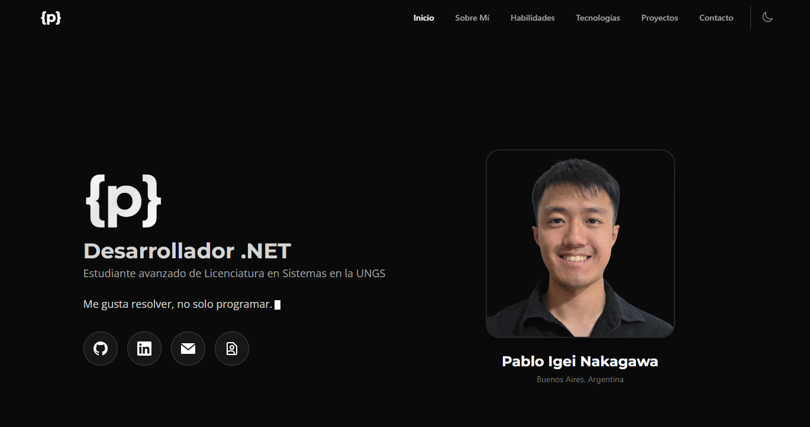

# Portfolio — Pablo Igei Nakagawa

Portfolio personal desarrollado para presentar mis proyectos y compartir mi perfil como desarrollador .NET y estudiante avanzado de Licenciatura en Sistemas en la UNGS.

[Ver portfolio en vivo](https://portfolio-pabloigeinakagawas-projects.vercel.app/) · [Ver perfil de GitHub](https://github.com/PabloIgeiNakagawa) · [Ver perfil de LinkedIn](https://www.linkedin.com/in/pablo-igei-nakagawa-4aaa06367/)



## Funcionalidades

- Diseño adaptable a dispositivos móviles y escritorio.
- Tema claro, oscuro o según la preferencia del sistema.
- Navegación por secciones y menú para pantallas pequeñas.
- Tarjetas de proyectos con tecnologías, repositorios y demos disponibles.
- Formulario de contacto con EmailJS y verificación reCAPTCHA.
- Animaciones con GSAP y soporte para la preferencia de movimiento reducido.

## Proyectos destacados

- **Tienda de Componentes PC:** [demo en vivo](https://techstoreargentina.runasp.net/) · [repositorio](https://github.com/PabloIgeiNakagawa/TiendaOnline)
- **Sistema de gestión de flota de vehículos:** [repositorio en GitLab](https://gitlab.com/GastonSanchez/tp-principal-manejo-de-flotas/-/tree/Produccion?ref_type=heads)
- **Información sobre Boca Juniors:** [repositorio](https://github.com/PabloIgeiNakagawa/boca-juniors)

## Tecnologías

- **Interfaz:** React, TypeScript, Tailwind CSS y React Router.
- **Animaciones:** GSAP y ScrollTrigger.
- **Contacto:** EmailJS y Google reCAPTCHA.
- **Build y despliegue:** Vite y Vercel.

## Ejecutar localmente

Requisitos: Node.js y pnpm.

```bash
git clone https://github.com/PabloIgeiNakagawa/portfolio.git
cd portfolio
pnpm install
pnpm dev
```

Comandos disponibles:

```bash
pnpm lint       # Revisa el código con ESLint
pnpm build      # Verifica TypeScript y genera la versión de producción en dist/
pnpm preview    # Sirve localmente la versión generada
```

El formulario usa una función de Vercel en `api/verify-recaptcha.js`; `pnpm dev` inicia solo el frontend de Vite. Para probar el envío localmente, también necesitás ejecutar la función de Vercel y configurar `VITE_RECAPTCHA_SITE_KEY` y `RECAPTCHA_SECRET_KEY` en el entorno. No publiques la clave secreta ni la incluyas en el repositorio.

## Estructura

```text
api/                     Funciones serverless de Vercel
src/
├── assets/               Imágenes, iconos y CV
├── components/           Componentes compartidos
├── data/                 Datos compartidos, como enlaces sociales
├── hooks/                Hooks reutilizables
├── layout/               Estructura general, encabezado y footer
└── pages/
    ├── home/components/  Secciones de la página principal
    └── not-found/        Página para rutas inexistentes
```
